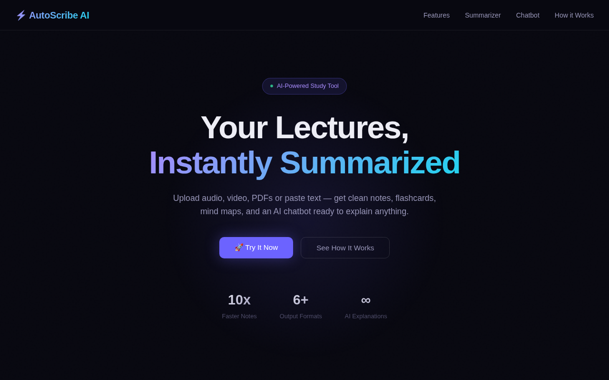
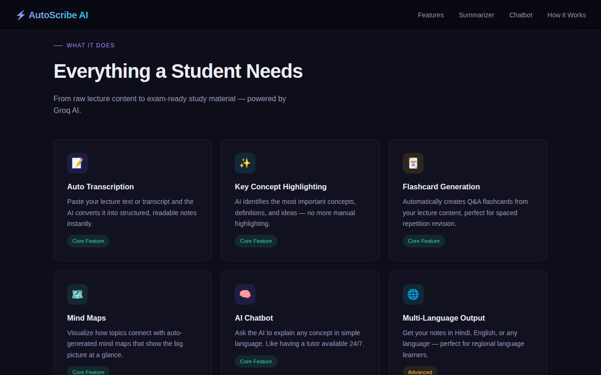
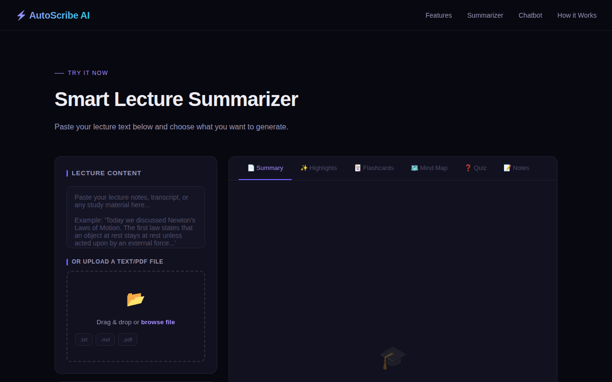
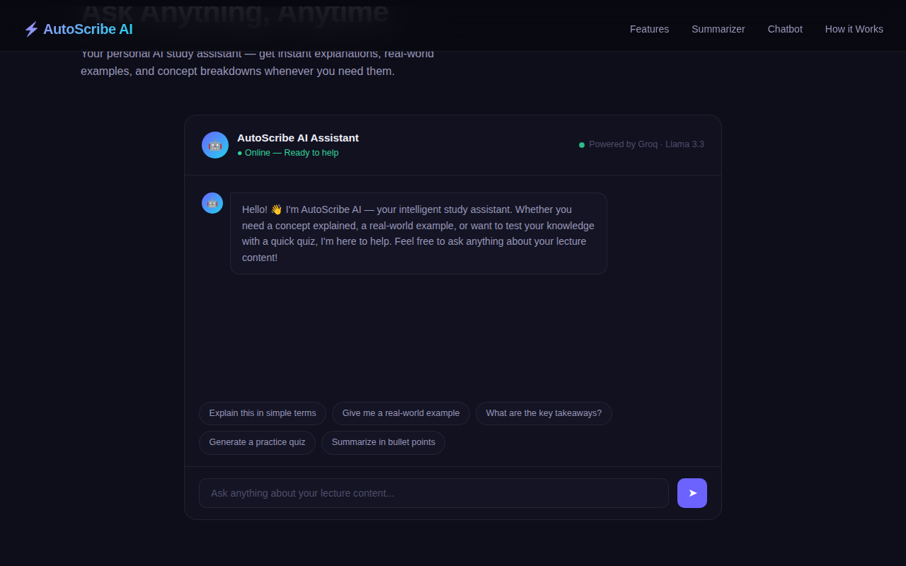
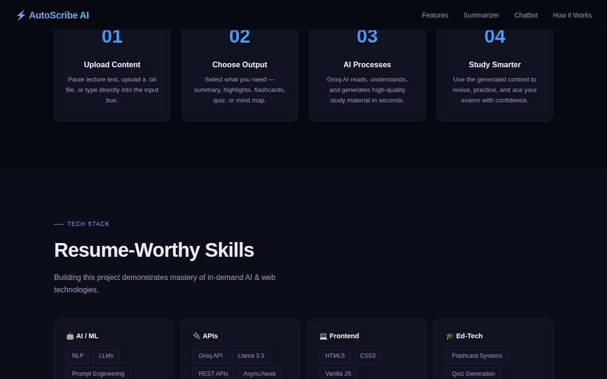

# ⚡ AutoScribe AI — Smart Lecture Summarizer

<div align="center">


**Transform raw lecture content into exam-ready study material — in seconds.**

[🚀 Live Demo](https://auto-scribe-ai.vercel.app/) &nbsp;·&nbsp; [📖 Features](#-features) &nbsp;·&nbsp; [⚙️ Setup](#%EF%B8%8F-setup) &nbsp;·&nbsp; [🛠️ Tech Stack](#%EF%B8%8F-tech-stack)

</div>

---

## 📌 Overview

**AutoScribe AI** is an intelligent, AI-powered web application that helps students convert raw lecture notes, transcripts, and PDFs into structured study material instantly. Built with **Groq's ultra-fast inference API** and **Meta's Llama 3.3 70B** model, it generates summaries, flashcards, mind maps, quizzes, and more — all within seconds.

> Built by **Divyanshu Gupta** · © 2026

---

## ✨ Features

| Feature | Description |
|---|---|
| 📄 **Smart Summary** | Generates a clean, well-structured summary from any lecture text |
| ✨ **Key Highlights** | Extracts the 10 most important concepts and definitions |
| 🃏 **Flashcard Generator** | Creates 8 Q&A flashcards with tap-to-reveal interaction |
| 🗺️ **Mind Map** | Visualizes topic structure with a central node and branches |
| ❓ **Quiz Generator** | Auto-generates 5 MCQs with answer reveal functionality |
| 📝 **Clean Notes** | Produces well-organized notes with headings and bullet points |
| 🤖 **AI Chatbot** | 24/7 AI tutor that explains concepts from your lecture content |
| 🌐 **Multi-Language** | Supports English, Hindi, Hinglish, Bengali, Tamil, Telugu, Spanish, French, German, Japanese |
| 📂 **File Upload** | Drag-and-drop support for `.txt`, `.md`, and `.pdf` files |
| 🔒 **Secure API** | API key is stored server-side via Vercel — never exposed to the browser |

---

## 🛠️ Tech Stack

### Frontend
- **HTML5, CSS3, Vanilla JavaScript** — No frameworks, fully responsive
- **PDF.js** (v3.11) — Client-side PDF text extraction
- **Google Fonts** — Syne + DM Sans typography

### Backend
- **Vercel Serverless Functions** (`/api/groq.js`) — Node.js edge function
- **Groq API** — Ultra-fast LLM inference
- **Meta Llama 3.3 70B Versatile** — The underlying language model

### Infrastructure
- **Vercel** — Hosting + serverless backend
- **Environment Variables** — Secure API key storage

---

## 📁 Project Structure

```
autoscribe-ai/
│
├── public/
│   ├── index.html        ← Main HTML (landing page + app UI)
│   ├── styles.css        ← All CSS styles (dark theme, animations)
│   └── app.js            ← All frontend JavaScript logic
│
├── api/
│   └── groq.js           ← Vercel serverless function (calls Groq API)
│
├── vercel.json           ← Vercel build + routing configuration
└── README.md
```

---

## ⚙️ Setup

### Prerequisites
- A free [Groq API key](https://console.groq.com) (takes 1 minute to get)
- A [Vercel account](https://vercel.com) (free tier works perfectly)
- Git + GitHub account

---

### Step 1 — Clone the Repository

```bash
git clone https://github.com/your-username/autoscribe-ai.git
cd autoscribe-ai
```

---

### Step 2 — Get Your Groq API Key

1. Go to [console.groq.com](https://console.groq.com)
2. Sign up or log in
3. Navigate to **API Keys → Create API Key**
4. Copy the key — you'll need it in the next step

---

### Step 3 — Deploy to Vercel

1. Push this project to a **GitHub repository**

2. Go to [vercel.com](https://vercel.com) → Click **Add New Project**

3. Import your GitHub repository

4. Before deploying, go to **Settings → Environment Variables** and add:

   | Key | Value |
   |-----|-------|
   | `GROQ_API_KEY` | `your_groq_api_key_here` |

5. Click **Deploy** ✅

> ⚠️ **Never hardcode your API key in any file.** The `/api/groq.js` serverless function reads it securely from Vercel's environment at runtime.

---

### Step 4 — You're Live! 🎉

Vercel will give you a URL like `https://autoscribe-ai.vercel.app`. Open it and start summarizing lectures.

---

## 🔒 Security Architecture

```
Browser (User)
     │
     │  POST /api/groq  (no API key)
     ▼
Vercel Serverless Function (/api/groq.js)
     │
     │  Reads GROQ_API_KEY from environment
     │  Forwards request to Groq API
     ▼
Groq API → Llama 3.3 70B
     │
     └─ Response → Back to browser
```

The API key **never leaves the server**. The browser only ever communicates with your own Vercel endpoint.

---

## 🚀 How It Works

```
1. Paste / Upload Lecture Content
          ↓
2. Select Output Types (Summary, Flashcards, Quiz, etc.)
          ↓
3. Click "Generate Now"
          ↓
4. Frontend sends text → /api/groq (Vercel Function)
          ↓
5. Vercel calls Groq API with structured prompt
          ↓
6. Llama 3.3 generates all sections in one pass
          ↓
7. Response is parsed and rendered in respective tabs
```

---

## 🌐 Supported Languages

English · Hindi · Hinglish · Bengali · Tamil · Telugu · Spanish · French · German · Japanese

---

## 📸 Screenshots

**Hero — Landing Page**


**Features Section**


**Smart Lecture Summarizer**


**AI Chatbot**


**How It Works**


---

## 🤝 Contributing

Pull requests are welcome! For major changes, please open an issue first to discuss what you'd like to change.

1. Fork the repository
2. Create your branch (`git checkout -b feature/your-feature`)
3. Commit your changes (`git commit -m 'Add: your feature'`)
4. Push to the branch (`git push origin feature/your-feature`)
5. Open a Pull Request

---

<div align="center">

Made with ❤️ by **Divyanshu Gupta**

⭐ If you found this useful, please star the repo!

</div>
